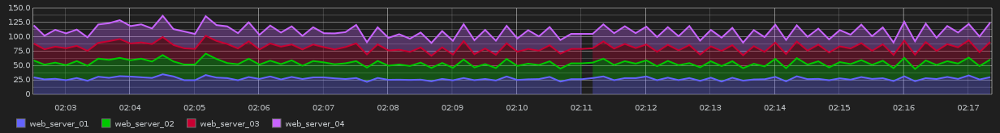

.. wordgraph documentation master file, created by
   sphinx-quickstart on Mon Aug  4 14:35:04 2014.
   You can adapt this file completely to your liking, but it should at least
   contain the root `toctree` directive.

.. toctree::
   :maxdepth: 2

   api

This is a thing that supports creating English-language text from a graph description. 
======================================================================================

Why
---

This project is intended to support anyone who is doing screen reading for any reason. This could be for vision-impaired people, or just people who like to listen to graphs while jogging, or just to get a handle on what's going on. Could potentially be used for generic data description also.

Kate Cunningham gave an amazing keynote at PyCon AU. Someone came up with the idea that graphs were a problem, and that maybe it would be possible to come up with a language description for those who wanted to understand the information, but couldn't see the graph.

What
----

When the data points for this graph:

Are passed through *wordgraph*, it generates the following description:

    "This graph shows the relationship between time and metric. The x axis,
    time, ranges from 04 Aug 2014 02:05:10 to 04 Aug 2014 02:20:00. The y axis,
    metric, ranges from 0 to 37.300000000000004. It contains 4 series."

    -- Wordgraph

Who
---
Maintainer: Tennessee Leeuwenburg @tleeuwenburg

Code Contributors (in order of first contribution):

1. Tennessee Leeuwenburg
2. Aaron Iles
3. Nick Farrel
4. Ryan Stuart
5. Rebecca Dengate

Architecture
------------

A core library takes an abstract graph description and produces English-language text. 

The basic usage is:

::

    > import wordgraph
    > text = wordgraph.describe(data, source_type)

For further reading, please checkout wordgraph.readthedocs.org
Contents:

